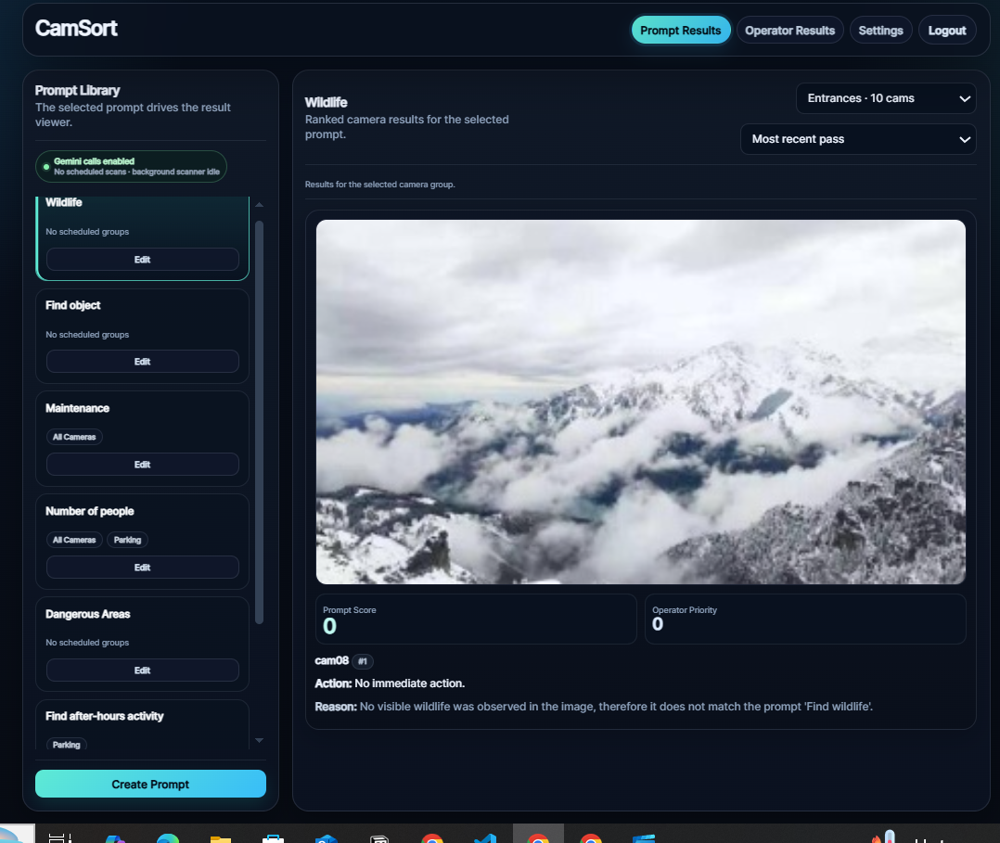
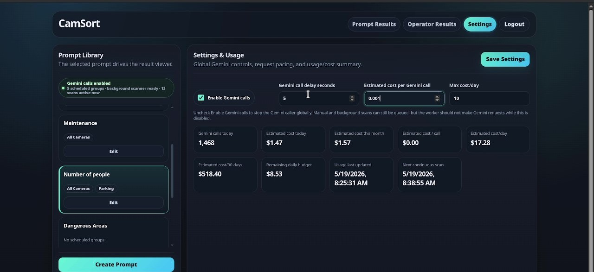

# CamSort AI

> Autonomous Camera Feed Prioritisation Agent using Vultr & Gemini  
> AI Agent Olympics Hackathon 2026 · Multimodal Intelligence + Collaborative Systems

---

# Overview

CamSort AI is an autonomous multimodal AI agent that continuously analyzes and prioritizes surveillance camera feeds in real time, helping security teams instantly identify the most critical situations.

Instead of manually monitoring hundreds of CCTV streams, operators can rely on AI-powered prioritization, risk scoring, and automated escalation.


# Demo

## Dashboard Preview



## Prompt Analysis Example



---

# Problem Statement

Security teams managing large facilities face three major challenges:

- Monitoring hundreds or thousands of camera feeds simultaneously
- Missing critical incidents due to attention overload
- Lack of intelligent prioritization in traditional CCTV systems

Current systems only display feeds — they do not understand or rank risk.

CamSort AI solves this by adding an autonomous AI decision layer on top of existing surveillance infrastructure.

---

# Key Features

## Multimodal AI Analysis

Google Gemini analyzes camera snapshots to detect:

- Hazards
- Suspicious activity
- Obstructions
- Safety risks
- Unusual behavior

---

## Real-Time Feed Ranking

Every feed receives:

- Priority score
- Risk classification
- AI-generated reasoning
- Recommended operator action

Feeds are continuously sorted based on urgency.

---

## Natural Language Control

```bash
"Sort by hazardous scenes"
"Show suspicious movement"
"Prioritize crowded areas"
```

---

## Automated Escalation

High-risk feeds automatically trigger:

- Escalation alerts
- Notifications
- Suggested operator actions

---

# System Workflow

```text
Operator Prompt
       ↓
Snapshot Capture
       ↓
Gemini Image Analysis
       ↓
AI Risk Scoring
       ↓
Live Dashboard Update
       ↓
Automated Escalation
```

---

# Tech Stack

| Technology | Purpose |
|---|---|
| Google Gemini | Multimodal image analysis |
| Go | Backend APIs & worker loop |
| PostgreSQL | Persistent storage |
| JavaScript / HTML | Real-time dashboard |
| Nginx | Load balancing |
| Vultr | Cloud deployment |
| Podman | Containerized deployment |

---

# Architecture

## Autonomous Agent Behavior

CamSort AI continuously cycles through four core stages:

### 1. Monitor
Collect snapshots from all registered camera feeds.

### 2. Analyze
Send images to Gemini for classification and risk scoring.

### 3. Rank & Update
Refresh dashboard priorities in real time.

### 4. Escalate
Trigger alerts automatically for high-risk feeds.

---

# Dashboard Features

- Live feed prioritization
- AI-generated explanations
- Risk labels
- Real-time updates
- Human-readable recommendations

---

# Commercial Potential

CamSort AI can be deployed across:

- Airports
- Smart cities
- Universities
- Warehouses
- Factories
- Corporate security centers

## Business Model

SaaS platform licensed per:

- Site
- Camera count
- Enterprise deployment

---

# Installation

## Clone Repository

```bash
git clone https://github.com/yourusername/camsort-ai.git
cd camsort-ai
```

---

## Backend Setup

```bash
cd backend
go mod tidy
go run main.go
```

---

## Frontend Setup

```bash
cd frontend
npm install
npm run dev
```

---

## Environment Variables

```env
GEMINI_API_KEY=your_api_key
DATABASE_URL=your_postgres_url
```

---

# Future Improvements

- Live video stream analysis
- Edge AI deployment
- Multi-camera event correlation
- Predictive anomaly detection
- Mobile security dashboard
- Voice-controlled operations

---

# Team

| Team Member | Role |
|---|---|
| Eesha Tariq | Dashboard UI & Frontend Design |
| David Castellon | AI Integration & System Architecture |
| Muhammad Usman | Coordination, Demo & Presentation |
| Nikita Kutsokon | Backend APIs & Database Systems |
| Waqar Ahmad | System Support & Development |

---

# Why CamSort AI?

✅ Autonomous AI agent  
✅ Real-time prioritization  
✅ Multimodal reasoning  
✅ Enterprise-ready architecture  
✅ Cloud deployed & scalable  
✅ Human-readable AI decisions

---

# License

MIT License

---

# Acknowledgements

- Google Gemini
- Vultr Cloud
- AI Agent Olympics Hackathon 2026
